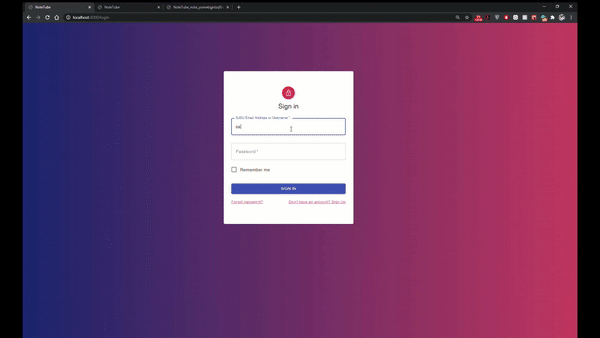

<h1 align="center">NoteTube</h1>
<h3 align="center">
  San Jose State University - Senior Project - Fall 2020
</h3>
<div align="center">
A web app that allows sjsu students to create, search, and use notes for classes </br></br>


</div>


### External Requirements
- Node.js
- git cli
- firebase-tools

### Run NoteTube

1. **Clone this repo**
```sh
$ git clone https://github.com/Sashanity/NoteTube.git
```

2. **Install dependencies**
```sh
# install dependencies for client side
$ cd NoteTube
$ npm i

# install dependencies for server side
$ cd NoteTube/server
$ npm i

# install firebase tools globally
$ npm install -g firebase-tools
```


3. **Add API keys files**
- Place `firebaseConfig.js` file to `NoteTube/server/function/util` directory
- Place `.env.local` to `NoteTube` directory

4. **Configure Google credentials**
- Place `ServiceAccountKey.json` (private key file) and <ins>save it somewhere outside the NoteTube folder</ins>
- Add GOOGLE_APPLICATION_CREDENTIALS environmental variable and add path to the `ServiceAccountKey.json`

Setup with environmental variable is safer because project would just fish out private key out of your environment.  
It is safer and also would work better in collaboration settings since hardcoded absolute path to the `ServiceAccountKey.json` would not work for each team member.

5. **Start your local server**
```sh
# Start client 
$ cd NoteTube/src
$ npm start

# Start backend server
$ cd NoteTube/server
$ firebase serve
```

